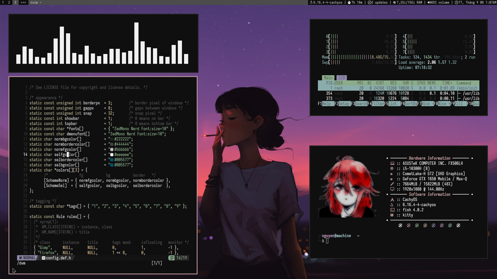

<h1 align="center">dotfiles</h1>




## How to use it

1. Clone this repo:

    ```shell
    git clone https://github.com/nguyenmlalgo/dotfiles.git
    cd $HOME/dotfiles/
    ```
2. Install GNU Stow:

    ```shell
    # On Arch Linux
    sudo pacman -S stow
    ```
3. Stow

    ```shell
    stow . 
    # or
    stow --adopt .
    ```
## Updating
To update the dotfiles pull this repo including its submodules.

```
git pull --recurse-submodules
```

## Dwm dependencies
```
pacman -S \
  kitty \
  maim \
  fish \
  rofi \
  picom \
  greenclip \  
```
